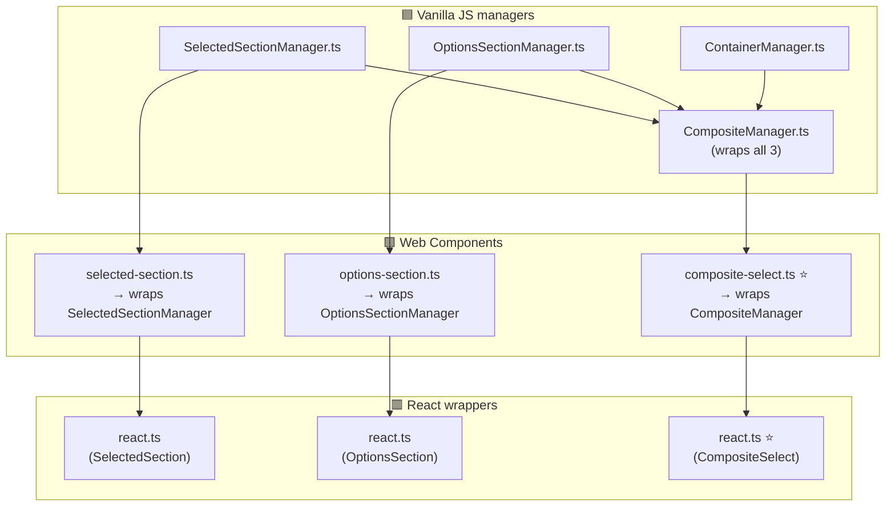

[](https://www.npmjs.com/package/composite-select)


## Links

- [npm](https://www.npmjs.com/package/composite-select)
- [demo](https://stopsopa.github.io/select-component/)
- [DEV.md](./DEV.md)
- [Architecture](./composition/Architecture.md)

# composite-select

A lightweight, headless **custom `<select>` replacement** that supports **multi-select, search/filtering, and popover-based dropdown rendering**, designed to be framework-agnostic and highly customisable.

It provides a minimal, object-oriented core that focuses purely on allowing user to control any UI aspect of these internal components like:

- Enable or disable this or that.
- Get the value of that with that method.
- Attach event triggerd when user change this.
- Methods to change list state here or value there.

On top of this core, there are thin wrappers that expose the same functionality as:

- **Vanilla JavaScript component**
- **Web Component**
- **React component**

The goal is to provide UI primitives and allow use to decide what exactly (granularly) select dropdown should do.

Also provide reasonable examples demonstrating it's capabilities.

TODO: At some point I would like to build some function wrappers or react component wrappers to encapsulate common use cases. Like dropdown with dynamic fetch search or for single element selection. Or for allowing user dynamically create but also select from existing. But when more control is needed, the user should always be able to step down from the abstraction and have control over the exact behaviour. I just need more time to think about it, but foundation is ready and tested here.

## Architecture

3 layers, each wrapping the one below. The **popover API** is used natively for dropdown positioning.



> ⭐ = main entry point for each layer

## Components

### 🟦 Vanilla JS managers

| Class | Purpose |
|---|---|
| [SelectedSectionManager.ts](./composition/selected-section/SelectedSectionManager.ts) | Renders the "selected items" widget — the visible pill/tag area with optional text input, clear button, and loading/disabled/error states |
| [OptionsSectionManager.ts](./composition/options-section/OptionsSectionManager.ts) | Renders the dropdown list — options to pick from, with search/filter input, footer (OK/Cancel), keyboard navigation, and empty-state placeholder |
| [ContainerManager.ts](./composition/container/ContainerManager.ts) | Positions one `<div>` on top of another using the native **Popover API**; provides `show()` / `hide()` control |
| [CompositeManager.ts](./composition/composite-select/CompositeManager.ts) ⭐ | Combines all three above into a single coordinated component — the main vanilla entry point |

### 🟩 Web Components

| File | Purpose |
|---|---|
| [selected-section.ts](./composition/selected-section/selected-section.ts) | Standalone custom element wrapping `SelectedSectionManager.ts`; exposes state as HTML attributes |
| [options-section.ts](./composition/options-section/options-section.ts) | Standalone custom element wrapping `OptionsSectionManager.ts`; exposes state as HTML attributes |
| [composite-select.ts](./composition/composite-select/composite-select.ts) ⭐ | Main web component — wraps `CompositeManager.ts` directly (not the other two WC elements); primary entry point when using this library as a web component |

### 🟥 React wrappers

| File | Purpose |
|---|---|
| [selected-section/react.ts](./composition/selected-section/react.ts) | React wrapper around the `selected-section.ts` web component |
| [options-section/react.ts](./composition/options-section/react.ts) | React wrapper around the `options-section.ts` web component |
| [composite-select/react.ts](./composition/composite-select/react.ts) ⭐ | React wrapper around `composite-select.ts` web component — primary entry point for React usage |

> All wrappers accept primitive values (strings, booleans, arrays) as attributes/props. For events and imperative control, access the underlying manager via `element.getManager()`.

## State & API

Two core states (arrays of objects):
- `mgr.selected.getSelected()` / `mgr.selected.setSelected([...])`
- `mgr.options.getOptions()` / `mgr.options.setOptions([...])`

Additional primitive states: `value`, `label`, `loading`, `disabled`, `error`, `showInput`, `showFilter`, `showFooter`, `maxHeight`.

## Accessing the Manager

Web components and React wrappers accept primitive values via attributes/props.  
For event binding and imperative control, get the underlying manager directly:

```js
// Web component
const mgr = document.querySelector('[data-role="cs"]').getManager();
mgr.container.show();
mgr.selected.setSelected([...]);

// React
const csRef = useRef(null);
csRef.current?.getManager()?.container.hide();
```

React wrappers also expose events as props (`selected-onDelete`, `options-onItemPick`, etc.) as a convenience — but only one handler per event type this way. For multiple handlers use `mgr.getSubscriber()`.

# testing

Project is thoroughly tested with Playwright end-to-end tests.

There was not much benefit in doing unit testing in here, because of the nature of the project.

