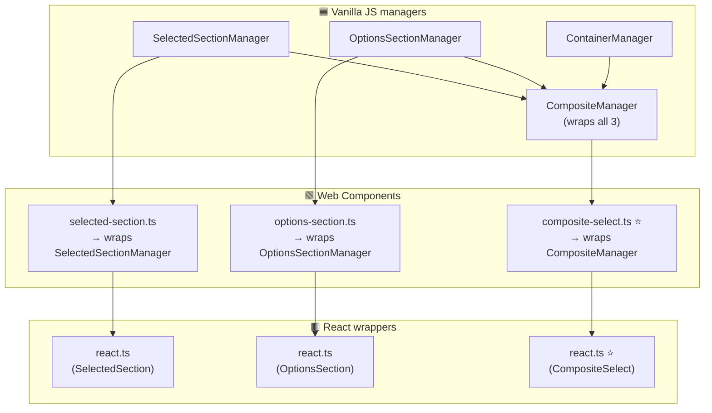

# composite-select

A custom `<select>` alternative with multi-select, search/filter, and popover-based dropdown — usable as **vanilla JS**, **Web Component**, or **React** component.

## Architecture

3 layers, each wrapping the one below. The **popover API** is used natively for dropdown positioning.



> ⭐ = main entry point for each layer

## Components

### 🟦 Vanilla JS managers

| Class | Purpose |
|---|---|
| `SelectedSectionManager` | Renders the "selected items" widget — the visible pill/tag area with optional text input, clear button, and loading/disabled/error states |
| `OptionsSectionManager` | Renders the dropdown list — options to pick from, with search/filter input, footer (OK/Cancel), keyboard navigation, and empty-state placeholder |
| `ContainerManager` | Positions one `<div>` on top of another using the native **Popover API**; provides `show()` / `hide()` control |
| `CompositeManager` ⭐ | Combines all three above into a single coordinated component — the main vanilla entry point |

### 🟩 Web Components

| File | Purpose |
|---|---|
| `selected-section.ts` | Standalone custom element wrapping `SelectedSectionManager`; exposes state as HTML attributes |
| `options-section.ts` | Standalone custom element wrapping `OptionsSectionManager`; exposes state as HTML attributes |
| `composite-select.ts` ⭐ | Main web component — wraps `CompositeManager` directly (not the other two WC elements); primary entry point when using this library as a web component |

### 🟥 React wrappers

| File | Purpose |
|---|---|
| `selected-section/react.ts` | React wrapper around the `selected-section` web component |
| `options-section/react.ts` | React wrapper around the `options-section` web component |
| `composite-select/react.ts` ⭐ | React wrapper around `composite-select` web component — primary entry point for React usage |

> All wrappers accept primitive values (strings, booleans, arrays) as attributes/props. For events and imperative control, access the underlying manager via `element.getManager()`.

## State & API

Two core states (arrays of objects):
- `mgr.selected.getSelected()` / `mgr.selected.setSelected([...])`
- `mgr.options.getOptions()` / `mgr.options.setOptions([...])`

Additional primitive states: `value`, `label`, `loading`, `disabled`, `error`, `showInput`, `showFilter`, `showFooter`, `maxHeight`.

## Accessing the Manager

Web components and React wrappers accept primitive values via attributes/props.  
For event binding and imperative control, get the underlying manager directly:

```js
// Web component
const mgr = document.querySelector('[data-role="cs"]').getManager();
mgr.container.show();
mgr.selected.setSelected([...]);

// React
const csRef = useRef(null);
csRef.current?.getManager()?.container.hide();
```

React wrappers also expose events as props (`selected-onDelete`, `options-onItemPick`, etc.) as a convenience — but only one handler per event type this way. For multiple handlers use `mgr.getSubscriber()`.

## Links

- [npm](https://www.npmjs.com/package/composite-select)
- [demo](https://stopsopa.github.io/select-component/)
- [DEV.md](./DEV.md)
- [Architecture](./composition/Architecture.md)


